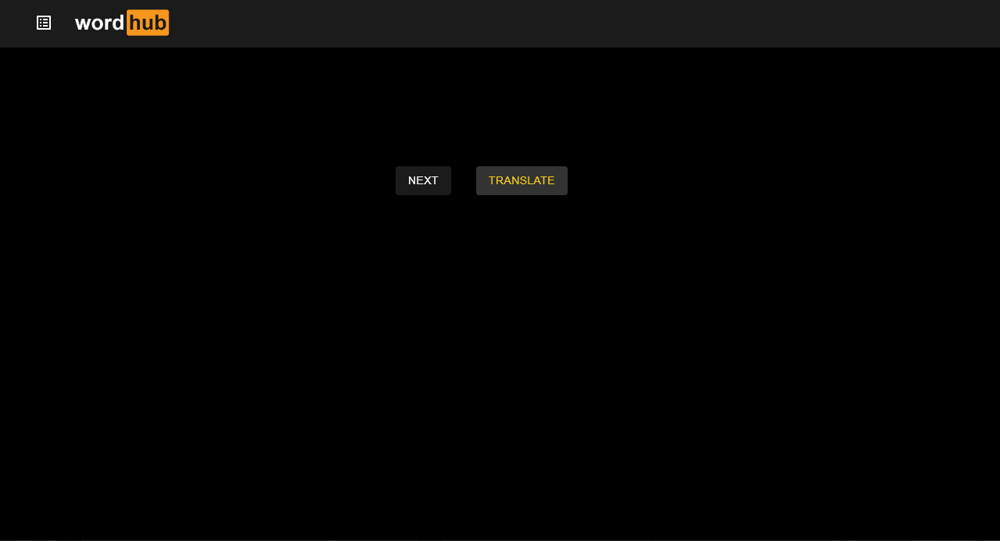

# Learning languages app / WordHub

[demo](https://andriydubovichwork.github.io/learning-languages-ts/)

I made this website for my self to learn some fancy english words.

# HOW IT WORKS:

## The API generates random fancy word and explanition of it then it translate it if you dont know word and push button translate

# Main screen

### at thees screen you can see generated wort it explanation and translation

## How actual buttons works:

## NEXT:
### on click website makes request to API get word and explain of it.Then website get word and explanation and translate it.after all it show the original word an explain of it.

## Translate:
### IF you dont know generated word you push translate button it will show you already translated text and save it to local storage for future

# Sidebar

### in sidebar you might see all translated word/word you dont knew you can translate them again or delet if you dont need them anymure

# How actual buttons works:

## Translate:
### translate selected words

## Delete:
### delete selected words

